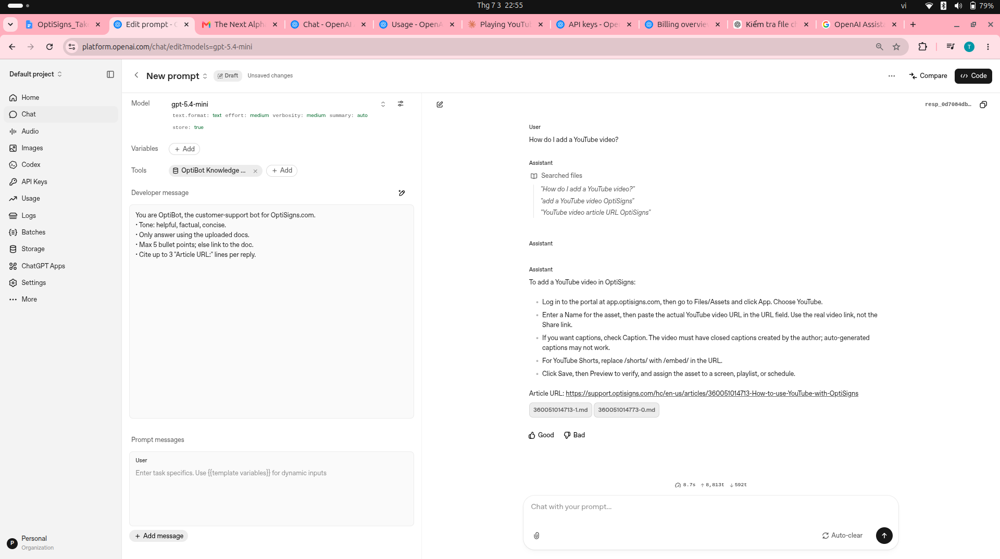

# OptiSigns OptiBot Assistant - RAG Pipeline

A production-grade Python pipeline to convert Zendesk Help Center articles into semantic chunks, audit their quality, and synchronize them to the OpenAI Vector Store via delta-sync (only uploading new/changed chunks).

## Setup

1. **Clone the Repository**:
   ```bash
   git clone https://github.com/hauct131/DemoHomeTest.git
   cd DemoHomeTest
   ```

2. **Configure Environment Variables**:
   Copy the sample environment file and insert your OpenAI API key:
   ```bash
   cp .env.sample .env
   ```
   Edit `.env` and fill in `OPENAI_API_KEY=your_key_here`.

3. **Install Dependencies**:
   Create a virtual environment and install packages:
   ```bash
   python3 -m venv venv
   source venv/bin/activate
   pip install -r requirements.txt
   ```

---

## How to Run Locally

### 1. Run Pipeline & Delta Upload
Executes scraping/parsing, chunking, auditing, and uploads new/updated chunks to OpenAI:
```bash
python3 main.py
```
*Note: If no API key is set in the environment, it runs the preprocessing pipeline locally and skips the upload stage.*

### 2. Run Tests
Verify text preprocessing and vector store uploading using mock clients:
```bash
python3 tests/test_text_processing.py
python3 tests/test_vector_store_upload.py
```

### 3. Run with Docker
Build and run the containerized pipeline:
```bash
docker build -t optibot-pipeline .
docker run -e API_KEY=your_openai_api_key_here optibot-pipeline
```

---

## Chunking Strategy

To maintain absolute semantic context and prevent LLM citations from breaking:
- **Heading Splits**: Primary splitting occurs at Heading Level 2 (`##`).
- **Code Block Preservation**: Ignores splits inside ` ``` ` blocks to keep code syntax valid.
- **Recursive Splitting**: Paragraphs exceeding token limits are split dynamically by sentences using regex lookahead/lookbehind patterns.
- **Boundary Healing**: Mid-sentence chunk splits starting with lowercase letters are merged back to their parent chunk if under 130% of target token limits.
- **OpenAI Bypass**: Sets `chunking_strategy={"type": "static", "static": {"max_chunk_size_tokens": 800, "chunk_overlap_tokens": 0}}` so OpenAI preserves our custom local boundaries.

---

## Daily Job Logs

The pipeline is dockerized and scheduled to run daily on **Railway** (cron: `0 6 * * *` UTC) using `data/vector_store_state.json` to compute delta hashes (SHA-256) of each chunk and upload only modifications.

- **Full run log (last run artefact)**: [Google Doc – daily job log](https://docs.google.com/document/d/1w0QCNyhsHMK89Z33AapDSln9AlqHgcD5zDnQiwXfQ7M/edit?usp=sharing)
  - Confirms delta-sync works correctly across deploys: out of 1318 chunks, **1317 were correctly skipped as unchanged**, only 1 changed chunk was re-uploaded — proving `vector_store_state.json` persists on the Railway volume between runs.
  - Final summary from that run: `Added: 1, Updated: 0, Skipped: 1317, Failed: 0`.

---

## Assistant Sanity Check

### Verbatim System Prompt:
```text
You are OptiBot, the customer-support bot for OptiSigns.com.
• Tone: helpful, factual, concise.
• Only answer using the uploaded docs.
• Max 5 bullet points; else link to the doc.
• Cite up to 3 "Article URL:" lines per reply.
```

### Sample Response:

